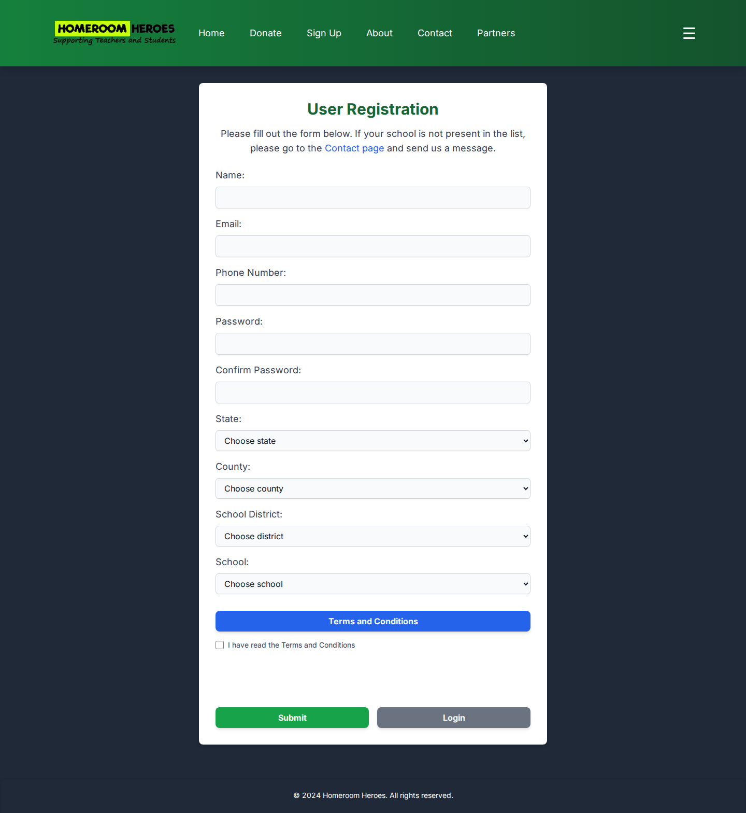
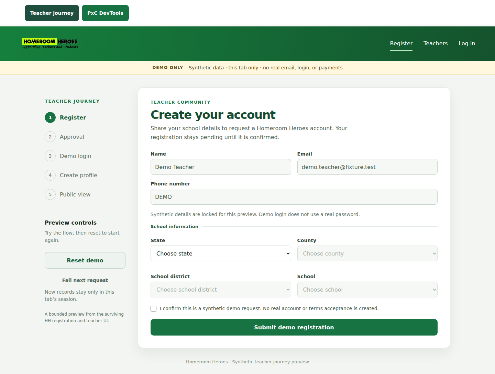
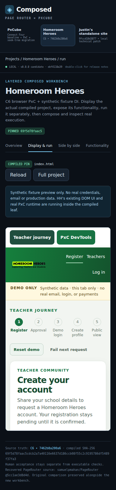

# Homeroom Heroes: frontend parity and environment handoff

Observed 2026-10-08. Source baseline: PageRouter commit `f47bbaf428afd7020fc7e1ff3813d2af73747f7c`.

The packaged local app demonstrates a synthetic teacher workflow. Reaching parity with the [current public site](https://www.helpteachers.net/pages/homepage.html) needs broader page coverage, matching presentation and assets, and representative offline interaction states. A fixture is fixed local example data; fixtures can support the missing frontend without a backend or live service.

This inventory covers discoverable public screens and the available local source. Authenticated screens and unexercised live actions are explicitly unknown. It does not claim complete knowledge of hidden production behavior.

## Open the inspected environment

From a PageRouter clone:

```sh
cd checkpoint
python3 -m http.server 4188 --bind 127.0.0.1 --directory dist
```

- Integrated PageRouter view: `http://127.0.0.1:4188/#/hh/run`
- Standalone leaf for equal-viewport comparison: `http://127.0.0.1:4188/compiled/hh/index.html#/register`

Serving `vendor/hh/src` directly is invalid: `app.mjs` requests `./services/index.mjs`, which exists at that location only after assembly. The failed preview and its module 404 are preserved as setup evidence. The assembled HH copies match current source after the two declared import rewrites.

The shell has Python but no `node`/`npm` on PATH. Full source rebuilding uses the repository's pinned Node, npm dependencies and Bazel configuration; the local inventory names their versions and commands. A cached whole-site Bazel receipt is stale because Git publication trimmed one trailing blank line in unrelated Block5 source. HH itself is current. A fresh whole-site build was not performed in this audit.

## Complete gap matrix

P0 means an enabling prerequisite. P1 means the main public teacher/donor journey. P2 means the remaining public content and support experience. “Missing” is established by local source and captured reference screens; “partial” means a related local feature exists.

| ID | Priority | Area and current gap | Required frontend work, with local data | Evidence / verification boundary |
|---|---|---|---|---|
| ENV-01 | P0 | Raw source is not a runnable standalone bundle. | Serve the assembled tree; keep the src/service copy and import-rewrite recipe reproducible. Provide a clear preview command. | Initial module 404; corrected leaf and integrated views loaded. |
| ENV-02 | P0 | Fresh-clone build and browser tools are not installed by the clone. | Bootstrap the pinned build tools for source rebuilds; supply external browser-tool paths for optional capture. Keep preview and audit tooling requirements separate. | No install/rebuild performed. Portable checksum and capture scripts are included. |
| ENV-03 | P0 | Cached whole-site receipt does not describe the latest source bytes. | Refresh the full build/receipt before claiming a fresh composed deployment. Existing HH output can be inspected now. | One unrelated whitespace-only input differs; HH package comparison passes. |
| UI-01 | P1 | Public page coverage and URLs differ. | Add Home, donor search, About, Contact, Partners, Login, Forgot Password and public teacher destinations. Decide explicit aliases for the reference `/pages/*.html` URLs while preserving PageRouter's outer routes. | Current leaf parses registration, login, profile, teachers and teacher-detail hashes only. |
| UI-02 | P1 | Public shell differs: navigation, navy canvas, spacing and typography. | Match the reference header/footer, active links, expanded mobile menu, forms and page layout. Keep PageRouter diagnostics available outside the site comparison surface. | Equal-width live/local registration screenshots; expanded live menu; integrated iframe capture. |
| UI-03 | P1 | Inter/Fraunces font files and much of the reference imagery are absent. | Provide local fonts, page styles and images. Inventory includes homepage tiles, teacher photo, team portraits and partner logos. Verify existing logo/hero assets rather than assuming a matching filename proves matching bytes. | Reference requests/fonts and image dimensions recorded; local font fallback and remote/local byte identity are unverified. |
| UI-04 | P1 | Donor homepage is missing. | Build hero, impact display, featured teacher, teacher registration, donation-intent and random-teacher cards. Use deterministic representative values and teacher fixtures. | Populated browser render supersedes earlier text-only loading/zero placeholders. Values are observations, not data-accuracy proof. |
| UI-05 | P1 | Teacher search is partial: local directory lacks the reference filter form. | State→county→district→school controls, dependent resets, Find Teachers action and result cards. Add representative match, empty, loading and failure fixtures. | Reference default result region was blank. Filtered live results and no-match behavior were not exercised. |
| UI-06 | P1 | Public profile presentation and actions are partial. | Teacher photo, school/location, biography, wishlist handoff and share affordance. Model featured/random/directory selection and missing-profile states with fixtures. | Public featured profile captured; local profiles exist with simplified content and inert wishlist. Wishlist/share outcomes were not activated. |
| UI-07 | P1 | Registration uses locked identity and omits password/confirmation and real Terms presentation. | Editable form fields, confirmation UI, school choices, scrollable Terms dialog, consent and client validation. Show mock submission/pending states without production account creation. | Live form and Terms modal inspected; live submission/password rules remain unverified. |
| UI-08 | P1 | Email/password Login and Forgot Password shells are missing. | Match credential/reset fields, navigation and representative invalid/pending/success-like local states. Keep them clearly simulated. | Public shells captured. Local demo-login click was not verified; authenticated fixture state was injected to inspect subsequent profile screens. |
| UI-09 | P2 | About/team content is missing. | Mission/process/team sections, portraits and Terms section, with matching layout. | Public About captured; source asset paths/dimensions listed. |
| UI-10 | P2 | Contact/support frontend is missing. | Fields, social destinations, message-length counter, school-not-listed support path and CAPTCHA placeholder footprint. Include local validation and explicit unsent result states. | Message counter changed after typing; no message sent and no CAPTCHA verification attempted. |
| UI-11 | P2 | Partners frontend is missing. | Grouped partner sections/logos and contact navigation. | Public partner sections captured; outbound partner behavior was not tested. |
| UI-12 | P1/P2 | Mobile and embedded presentation need separate parity checks. | Compare standalone leaf with the same reference viewport. Separately verify embedded scrolling, reachable controls, menus and focus inside PageRouter. | The embedded frame is smaller than the browser viewport; surrounding workbench chrome is intentional and should not be mistaken for site styling. |
| UI-13 | P1/P2 | Complete offline state coverage and accessibility are unverified. | Preserve useful fixture error/retry/storage/reset behavior; add missing route/form/result states. Check labels, keyboard order, modal focus/close, menu controls, readable errors and reduced motion. | Existing local state controls work in the inspected fixture path. Source attributes and screenshots do not establish full keyboard/accessibility behavior. |
| UI-14 | Unknown | Role-dependent My Page, Logout, Forum and Validation screens are unobserved. | Inventory intended frontend routes and render role-specific fixtures when reference evidence becomes available. | Hidden controls were present in anonymous DOM; authenticated screens were not inspected. No public Privacy route was found in the inspected surfaces. |

## What can be preserved

The local demo already has registration school selection, pending/simulated approval, session-local profiles, a seeded directory, public profile display, reset and diagnostic controls. Its service contracts and fixture adapter are useful foundations. Keep that work available while adding the missing public frontend.

The captured local path made no external requests. Its profile screens were inspected using an injected authenticated fixture, so the report does not convert those screenshots into proof that the login button works. The old HTTP adapter deliberately reports unsupported operations without sending requests.

## Suggested enabling order

1. Establish the assembled preview and reproducible source/build checks.
2. Add the public shell, routes, local styles/fonts/assets and responsive baseline.
3. Complete the donor path: homepage → filtered directory or featured/random teacher → public profile → mocked wishlist/share handoff.
4. Complete registration, Terms, login and reset frontend states.
5. Add About, Contact and Partners; exercise all offline error/empty/loading states and keyboard/mobile behavior.

Acceptance for a frontend parity implementation should require matching captured initial states and working local controls at both reference viewports. Fixture actions must remain distinguishable from production outcomes. The unknown authenticated screens need additional reference evidence before an implementation can claim parity there.

## Explicitly excluded

Backend creation or connection, production identity/password authentication, actual approval/moderation, email/reset/contact delivery, live teacher/impact-data correctness, CAPTCHA verification, donations/payments, external wishlist transactions and changes to production data. Their visible frontend fields, buttons, placeholders and local state transitions remain part of the gap inventory.

## Evidence and repeatable investigations

- [Local source/environment inventory and per-gap acceptance checks](local/LOCAL-ENVIRONMENT.md)
- [Reference routes, numbered screenshot guide and observed interactions](reference/REFERENCE-FLOWS.md)
- [Capture reproduction commands and external tool paths](reference/CAPTURE-REPRODUCTION.md)
- [Local machine-readable inventory](local/inventory.json)
- [Reference route/state/assets inventory](reference/ROUTE-STATE-INVENTORY.json)
- [Reference gap candidates](reference/GAP-CANDIDATES.json)

Read-only checksum helpers live in `work/homeroom-parity/local/`; configurable browser capture scripts live in `work/homeroom-parity/reference/`. They do not implement frontend changes.

### Registration comparison, same desktop viewport

Reference:



Local assembled leaf:



### PageRouter mobile integration



## Limits

This is a source inventory and observed public-frontend comparison. It is not a fresh build, a complete accessibility audit, a production-auth test or a backend diagnosis. Missing/unobserved behavior is labeled separately from a confirmed gap. The direct-source startup mistake, superseded text-only states and other capture diagnostics remain preserved.
